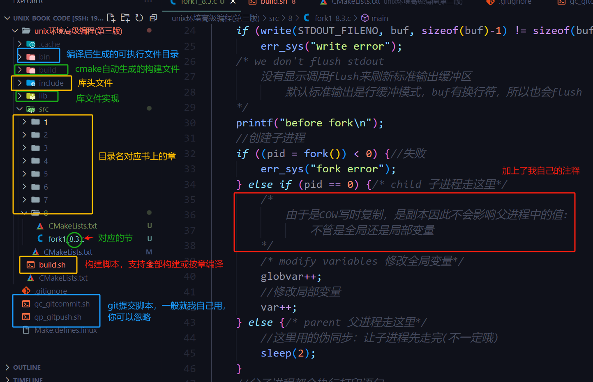

# 1.项目
## APUE书中的代码(UNIX 环境高级编程第3版)
  * 原书的代码目录不够清晰，此项目按**章节**整理了各个源码
  * 使用**CMake**现代构建工具代替了书中的make构建工具
  * 源码定制成**linux**的实现
## 编译命令
* `编译环境`
  * centos操作系统
  * gcc编译器
  * cmake至少3.0以上
* `编译构建`
  * 进入"unix环境高级编程(第三版)"目录
  * 编译所有章节
    * sh build.sh gen
  * 只编译某一个章节:比如第一章就是1，第2章就是2
    * sh build.sh gen 1  

* `清除`
  * sh build.sh clean

# 2.目录说明
